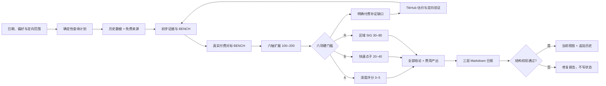

# AI Opportunity Radar

一个面向通用 AI Agent 的创业机会研究与个人验证工具。它先寻找真实付费产品与现有支出，再围绕细分人群、购买触发、AI 新形态、地区、渠道和交付方式批量扩展点子，最后用硬门槛过滤并输出三层机会。

项目坚持“先付费事实，后需求行为，再产品形态”：批量生成可以宽，进入正式机会必须严。热门话题、愿望表达和单次搜索无结果都不会被直接包装成市场结论。

## 核心能力

| 能力 | 说明 |
|---|---|
| 付费对标 | 为每条候选建立稳定 `BENCH`，记录产品、付款者、价格/支出和付款证据 |
| 批量点子 | 沿六个维度扩展原始变体，按业务身份归并机会，保留来源对标与验证假设 |
| 硬过滤 | 付款市场、付款者、替代方案、产品缺口、获客渠道、30 天 MVP 缺一不可 |
| 三层日报 | 深度 A、快速 A/B、区域 R 分层；数量不足时保留真实结果，不凑数 |
| 完整结论清单 | 展示全部 A/B/R、全部 overflow 和最多 20 个接近合格候选，不只返回 Top 5 |
| 定向扫描 | 按地区、语言、行业或机会类型复用同一研究流程 |
| 机会深挖 | 围绕稳定机会 ID 补充独立证据、反证、竞品、MVP 和验证实验 |
| 历史回顾 | 比较近 7/30/90 天的出现次数、评分和证据变化 |
| 多语言研究 | 覆盖英语、中文及东南亚、南亚、非洲、中东、拉美的轮换语言查询 |
| 费用产出 | 先免费发现、后付费补证，并计算证据利用率、来源转化和单个合格结论成本 |
| 可重放状态 | 使用稳定 ID、追加式观察历史、文件锁和原子写入支持安全重跑 |
| 证据升级 | R/SIG 补齐本地付款、独立来源和候选验证后，升级为 A/OPP 并保留双向链接 |
| 技能与版本管理 | `aor` 查看本项目技能，`doctor` 检查环境和稳定版本，`update` 显式升级受管安装 |

深度机会仍分三条评分轨道：

- `needle`：针尖型机会，强调明确用户、明确触发时刻和单一任务。
- `new_form`：老产品新形态，强调代理、语音、长期记忆、动态生成或社交体验带来的重做机会。
- `regional_gap`：区域错配型机会，强调语言、文化、价格、渠道和本地集成缺口。

评分只对已经通过硬门槛的 A 级候选排序。未进入 Top 5 的 A 级候选可以保留为快速卡片；B 级不做冗长推演；缺目标地区付款证据的区域创意统一保留为 R/SIG。

## 数据源范围

一期只使用已经完成端点、参数和费用约束的平台：

- 内置公开适配器：Hacker News、GitHub Issues。
- TikHub：TikTok、Instagram、LinkedIn、Threads、X、YouTube、Reddit、抖音、小红书、B站、知乎、微信搜一搜/公众号。

TikHub 采用“每日核心源 + 三日滚动源”，避免每天对全部平台重复发起相同请求。只有本次运行实际返回非空、相关且可核验证据的来源才会被标记为已覆盖。

Product Hunt、Indie Hackers、应用商店、G2/Capterra/Trustpilot、V2EX、即刻、脉脉、Telegram、微博、快手等尚未进入一期自动采集范围。

## 架构



项目分为两层：

- `SKILL.md` 与 `references/` 定义研究方法、机会政策、查询语言、安全边界和报告契约。
- `scripts/` 提供确定性工具，负责查询计划、数据采集、费用保护、规范化、稳定 ID、评分、报告校验、状态恢复和个人验证实验记录。

付费证据核验、反证判断、维度设计、中文翻译和报告撰写仍由 AI Agent 完成；扩展、硬过滤、ID、评分、报告结构与状态由脚本确定性约束。

## 通用 Agent 使用方式

任何能够读取文件并运行 Python 命令的 AI Agent 都可以使用本项目；没有特定模型、客户端、SDK 或宿主目录依赖。只支持聊天的环境可以读取方法文档，但需要用户或外部执行器运行脚本。

1. 按下方步骤安装，让 Agent 读取安装结果中的 `current/SKILL.md`；源码使用者也可以直接读取仓库根 `SKILL.md`。
2. 调用技能时先运行 `aor doctor --quiet`，再用 `aor COMMAND ...` 执行研究；已是最新时不提示，发现新版本才显示版本号和 `aor update` 命令。子命令后使用 `--help` 查看参数。
3. 使用 JSON 文件交换数据；`python3 scripts/radar.py` 和原有独立脚本入口继续兼容。下面的相对路径示例在仓库根目录运行。

详细能力要求与宿主接入方式见 [通用 Agent 集成](references/agent-integration.md)。[agent-manifest.json](agent-manifest.json) 是本项目自带的机器可读索引，不要求宿主支持某个专用协议。

```bash
python3 scripts/radar.py plan --date 2026-09-10 --output /tmp/query-plan.json
python3 scripts/radar.py expand --input examples/benchmarks-and-dimensions.json --output /tmp/expanded.json
python3 scripts/radar.py filter --input /tmp/expanded.json --output /tmp/tiered.json
```

示例带 `is_demo` 标签，不会成为 A 级真实付款机会；演示的 B/R 也不代表已验证的真实市场。报价方式只作为同一机会的变体保留，不增加独立机会计数。快速摘要可以直接使用这些 `CAND` 标识；正式日报、A 级评分和实验引用使用下面准备的稳定 `OPP/SIG`。

## 为自己选择值得验证的项目

市场证据和个人适配分别展示。先填写 [个人约束示例](examples/founder-profile.json)，为候选补充 `validation_plan`，再执行：

```bash
python3 scripts/radar.py validation assess \
  --profile examples/founder-profile.json \
  --input /tmp/tiered.json --output /tmp/personal-review.json
```

结果为 `validate`（可安排验证）、`clarify`（补齐未知项）或 `park`（先解决资源冲突），不把未知技能、渠道、时间或预算默认判为适配。默认建议一个主验证项目、最多两个备选。

准备实验前，先把选中的 A/B 候选交给 `state prepare --kind opportunity`，取回稳定 OPP。下面承接 `/tmp/tiered.json`，仅选择首条 A/B 演示串联；实际选择应依据个人评估结果：

```bash
python3 - <<'PYTHON'
import json
from pathlib import Path
payload = json.loads(Path('/tmp/tiered.json').read_text())
choices = payload['deep_candidates'] + payload['validated_ideas']
if not choices:
    raise SystemExit('没有 A/B 候选；如选择 R，请提取 regional_signals 并使用 --kind signal')
selected = dict(choices[0])
selected.update(run_id=payload['run_id'], as_of=payload['as_of'])
Path('/tmp/selected-candidate.json').write_text(json.dumps(selected, ensure_ascii=False))
PYTHON

python3 scripts/radar.py state prepare \
  --home /tmp/radar-demo --kind opportunity \
  --date "$(python3 -c 'import json; print(json.load(open("/tmp/selected-candidate.json"))["as_of"])')" \
  --input /tmp/selected-candidate.json --output /tmp/selected-with-id.json

python3 - <<'PYTHON'
import json
from pathlib import Path
candidate = json.loads(Path('/tmp/selected-with-id.json').read_text())[0]
experiment = json.loads(Path('examples/experiment.json').read_text())
experiment.update(record_id=candidate['id'], run_id=candidate['run_id'],
                  as_of=candidate['as_of'], experiment_id='EXP-' + candidate['id'] + '-001')
Path('/tmp/planned-experiment.json').write_text(json.dumps(experiment, ensure_ascii=False))
PYTHON

python3 scripts/radar.py validation record-experiment \
  --home /tmp/radar-demo --input /tmp/planned-experiment.json
python3 scripts/radar.py validation experiments --home /tmp/radar-demo
```

R 级选择 `regional_signals`，用 `--kind signal` 准备 SIG，实验 `record_id` 引用该 SIG。`prepare` 只解析 ID，不提交研究观察；计划实验可立即记录，无需先生成日报或执行 `record-batch`。上例仅保存 `planned` 与空行为证据，不能当作已完成验证。执行真实实验后另开新运行记录客户行为、费用、投入时间及决定。

实验不会自动联系客户或改变 A/B/R。口头反馈、真实任务、接受报价、付费试点分开记录。完整字段和幂等规则见 [个人适配与验证](references/personal-validation.md)。

## 环境要求

- Python 3.10 或更高版本。
- macOS 或 Linux。状态锁使用 `fcntl`，当前不支持原生 Windows。
- 运行时只依赖 Python 标准库。
- 安装稳定版本和升级需要 Git，以及访问 GitHub 的网络连接。
- 开发与测试需要 `pytest` 和 `ruff`。
- Hacker News 无需凭证；GitHub Token 可选；TikHub 搜索需要 API Key 和显式预算。

可选环境变量：

```bash
export AI_OPPORTUNITY_RADAR_HOME="$HOME/Documents/AI-Opportunity-Radar"
export GITHUB_TOKEN="可选，用于提高 GitHub API 限额"
export TIKHUB_API_KEY="可选，仅在执行 TikHub 付费查询时需要"
```

不要把令牌写入计划、报告、状态文件或仓库。

## 安装为 Agent Skill

首次安装先取得项目文件，再创建独立的受管安装。已有源码仓库时，直接在仓库根运行最后一条命令：

```bash
git clone https://github.com/Snychng/ai-opportunity-radar.git
cd ai-opportunity-radar
python3 scripts/radar.py install
```

安装器从官方最新稳定 Release 对应的 Git 标签取得版本，创建 `~/.local/bin/aor` 命令和 `~/.local/share/aor/current/SKILL.md` 入口。源码目录可继续用于开发，研究数据保存在独立的数据目录。

如果终端尚未包含命令目录，可先为当前会话设置：

```bash
export PATH="$HOME/.local/bin:$PATH"
aor --version
aor skills
aor doctor --refresh
```

安装器不会修改 shell 配置，也不会覆盖其他程序已经占用的 `aor` 命令。按宿主自身的加载方式，让 Agent 读取 `~/.local/share/aor/current/SKILL.md`；仅创建这个目录不会让所有宿主自动发现技能。

日常检查与更新：

```bash
aor                     # 当前版本、安装路径、技能数与已有更新缓存
aor skills --json       # 只列出本项目登记的技能
aor doctor --json       # 环境诊断与稳定版本检查
aor doctor --quiet      # 日常启动检查，仅提示新版本或本地致命错误
aor doctor --offline    # 只检查本地与有效缓存
aor update              # 显式升级受管安装
```

业务命令启动时会检查更新：成功结果缓存 24 小时，网络失败短暂缓存 5 分钟并显示未知，检查失败不阻断研究。有新版本时只提示；执行 `aor update` 后，让 Agent 重新读取 `current/SKILL.md` 和本次用到的参考文件。纯文档提示不能强制所有宿主执行命令，项目 CLI 与兼容脚本入口提供实际预检。

当前只登记 `ai-opportunity-radar` 一个技能；以后登记的本项目子技能随同一 Release 更新。`aor` 不扫描或管理其他项目的技能。源码副本可直接运行工具，但 `aor update` 只替换 AOR 自己登记的版本目录，不在源码仓库内执行拉取或覆盖。

自定义安装目录、离线开发快照、更新状态含义和故障处理见 [安装与更新](references/installation-updates.md)。稳定发行记录见 [CHANGELOG](CHANGELOG.md) 和 [GitHub Releases](https://github.com/Snychng/ai-opportunity-radar/releases)。

安装后可在 AI Agent 中直接提出：

```text
运行今天的 AI 创业机会雷达
给我很多有真实市场需求、30 天能做 MVP 的点子
扫描东南亚本地语言 AI 社交产品机会
深挖 OPP-20260714-A1B2C3
回顾最近 30 天升温的机会
```

## 脚本快速开始

以下命令展示底层工具的主要路径。完整日报仍建议由 AI Agent 按 [`SKILL.md`](SKILL.md) 编排。

```bash
export SKILL_DIR="${AOR_INSTALL_HOME:-$HOME/.local/share/aor}/current"
export RADAR_HOME="${AI_OPPORTUNITY_RADAR_HOME:-$HOME/Documents/AI-Opportunity-Radar}"
RUN_DATE="$(TZ=Asia/Shanghai date +%F)"
RUN_DIR="$RADAR_HOME/raw/$RUN_DATE"

mkdir -p "$RUN_DIR"

python3 "$SKILL_DIR/scripts/manage_state.py" init \
  --home "$RADAR_HOME"

python3 "$SKILL_DIR/scripts/build_query_plan.py" \
  --date "$RUN_DATE" \
  --home "$RADAR_HOME" \
  --output "$RUN_DIR/query-plan.json" \
  --export-community-plan "$RUN_DIR/community-plan.json" \
  --export-tikhub-plan "$RUN_DIR/tikhub-search-plan.json"

python3 "$SKILL_DIR/scripts/community_query.py" doctor --json

python3 "$SKILL_DIR/scripts/community_query.py" run \
  --plan "$RUN_DIR/community-plan.json" \
  --output "$RUN_DIR/community-normalized.json"
```

### TikHub：先形成候选缺口，再估价执行

先用历史、公开来源和初步过滤结果明确候选 ID、缺失门槛、目标地区、预期升级层级、本地语言关键词和 1–3 个目标来源，写入 `evidence-gaps.json`。初始化阶段导出的通用搜索计划只作草稿，不直接付费执行：

```bash
python3 "$SKILL_DIR/scripts/tikhub_query.py" build-gaps \
  --date "$RUN_DATE" \
  --run-id RUN-YYYYMMDD-XXXXXXXXXX \
  --input "$RUN_DIR/evidence-gaps.json" \
  --output "$RUN_DIR/tikhub-gap-plan.json"
```

估价只读取公开实时价格，不调用付费数据端点：

```bash
python3 "$SKILL_DIR/scripts/tikhub_query.py" estimate \
  --plan "$RUN_DIR/tikhub-gap-plan.json" \
  --output "$RUN_DIR/tikhub-cost-estimate.json"
```

确认费用后，通过环境变量提供密钥，并设置硬性预算上限：

```bash
python3 "$SKILL_DIR/scripts/tikhub_query.py" run \
  --plan "$RUN_DIR/tikhub-gap-plan.json" \
  --max-cost-usd 0.10 \
  --output "$RUN_DIR/tikhub-gap-results.json"

python3 "$SKILL_DIR/scripts/normalize_tikhub_results.py" \
  --input "$RUN_DIR/tikhub-gap-results.json" \
  --output "$RUN_DIR/tikhub-normalized-search.json" \
  --selection-output "$RUN_DIR/tikhub-comment-candidates.json"
```

执行器会依次检查：实时价格、端点白名单、最坏成本、零费用账户预检端点、账户状态、免费额度和付费余额。任一条件不满足时，不发起付费数据请求。

付费发现最多占预算 20%；每个请求必须服务于候选升级或硬门槛验证。定向搜索补证每来源每批最多 3 请求是脚本硬限制，两个来源合计 4 请求合法。每批后由 Agent 评估新增 BENCH、A/B/R 或关键证据，无产出时停止该来源，不追加新批；执行器不能自动判断商业价值。

从评论候选中选择 1–5 条并补充 `selection_reason` 后，可按 [`references/tikhub-integration.md`](references/tikhub-integration.md) 生成独立评论计划。评论翻页必须重新建计划和估价。

### 付费对标、批量扩展与硬过滤

先按 [`references/data-contracts.md`](references/data-contracts.md) 整理 `benchmarks-and-dimensions.json`。仓库提供了可直接运行的[示例输入](examples/benchmarks-and-dimensions.json)；其中 URL 和商业数据均为演示占位符，不是市场证据：

```bash
python3 "$SKILL_DIR/scripts/expand_ideas.py" \
  --input "$RUN_DIR/benchmarks-and-dimensions.json" \
  --limit 200 \
  --output "$RUN_DIR/expanded-candidates.json"

python3 "$SKILL_DIR/scripts/filter_ideas.py" \
  --input "$RUN_DIR/expanded-candidates.json" \
  --output "$RUN_DIR/tiered-candidates.json"
```

过滤结果包含 `deep_candidates`、`validated_ideas`、`regional_signals` 和带失败原因的 `rejected`。目标数量不足时保留真实数量，不用弱证据补齐。

### 稳定 ID 与 A 级评分

完整研究顺序为：过滤 → A/B 准备 OPP、R 准备 SIG → A 级评分 → 完整清单 → 日报校验 → 提交研究观察。过滤器已聚合报价变体；对 `deep_candidates`、`validated_ideas`、`regional_signals` 及 overflow 分别准备稳定 ID，把返回记录替换回对应数组并另存 `tiered-candidates-with-ids.json`。单条提取和准备命令见上方实验示例。

下面展示已提取 A 级数组 `deep-candidates.json` 的评分路径；A 级为空时跳过。准备 B/R 不需要评分。

```bash
python3 "$SKILL_DIR/scripts/manage_state.py" prepare \
  --home "$RADAR_HOME" \
  --kind opportunity \
  --date "$RUN_DATE" \
  --input "$RUN_DIR/deep-candidates.json" \
  --output "$RUN_DIR/deep-candidates-with-ids.json"

python3 "$SKILL_DIR/scripts/score_candidates.py" \
  --input "$RUN_DIR/deep-candidates-with-ids.json" \
  --output "$RUN_DIR/scored-deep-candidates.json"
```

### 完整结论清单与费用产出

使用准备好稳定 ID 的分层结果生成正式完整清单；A 级评分结果按 ID 回填对应候选后再输出日报。快速浏览也可直接传原始 `tiered-candidates.json`，此时清单使用 `CAND`，不能把它当实验 `record_id`。`--execution`、`--evidence`、`--research` 均可重复传入实际存在的文件：

```bash
python3 "$SKILL_DIR/scripts/build_result_digest.py" \
  --tiered "$RUN_DIR/tiered-candidates-with-ids.json" \
  --execution "$RUN_DIR/tikhub-gap-results.json" \
  --evidence "$RUN_DIR/tikhub-normalized-search.json" \
  --output "$RADAR_HOME/reports/daily/$RUN_DATE-full-results.md" \
  --metrics-output "$RUN_DIR/result-yield.json"
```

输出会展示全部 A/B/R 和 overflow、接近合格拒绝项、独立机会家族、付费请求、费用、证据利用率及来源转化。A/B 研究资格与 R 级迁移假设分别计数；执行结果重复副本去重，旧运行费用不能混入当前运行。聊天默认展示这份清单的全部紧凑卡片，不能只给 Top 5 或链接。

### 状态提交

Markdown 日报结构校验通过后才能写入历史：

```bash
python3 "$SKILL_DIR/scripts/validate_report.py" \
  "$RADAR_HOME/reports/daily/$RUN_DATE.md"

python3 "$SKILL_DIR/scripts/manage_state.py" record-batch \
  --home "$RADAR_HOME" \
  --kind opportunity \
  --date "$RUN_DATE" \
  --run-id RUN-YYYYMMDD-XXXXXXXXXX \
  --input "$RUN_DIR/opportunities.json"
```

R 级区域创意应使用 `--kind signal` 独立分配和提交。实际 `run_id` 从 `query-plan.json` 读取，不手工构造或跨日期复用。

R/SIG 补齐目标地区直接付款、两个独立来源及全部候选验证后可升级为 A/OPP：

```bash
python3 "$SKILL_DIR/scripts/manage_state.py" promote \
  --home "$RADAR_HOME" \
  --signal-id SIG-YYYYMMDD-XXXXXX \
  --date "$RUN_DATE" \
  --run-id RUN-YYYYMMDD-XXXXXXXXXX \
  --input "$RUN_DIR/promoted-opportunity.json"
```

## 数据契约

- `schema_version`：当前为 `3.0`。
- 运行 ID：`RUN-YYYYMMDD-XXXXXXXXXX`。
- 付费对标 ID：`BENCH-XXXXXXXX`。
- 机会 ID：`OPP-YYYYMMDD-XXXXXX`。
- 信号 ID：`SIG-YYYYMMDD-XXXXXX`。
- 机会身份由 `target_user + context + problem_or_desire + wedge`，以及存在时的国家、地区和主渠道决定；不依赖标题或翻译。
- 同一 `run_id + kind + fingerprint` 且输入相同的重放不会重复创建事件；同一运行更改输入会报冲突，修订需新运行。
- 同日不同运行可以保存新的评分快照，但 `occurrences` 只按唯一日期计数。

详细阶段输入输出见 [`references/data-contracts.md`](references/data-contracts.md)。

## 状态目录

```text
$RADAR_HOME/
├── config/
│   └── preferences.json
├── raw/
│   └── YYYY-MM-DD/
├── reports/
│   ├── daily/
│   └── deep-dives/
└── state/
    ├── opportunities.jsonl
    ├── opportunity-observations.jsonl
    ├── signals.jsonl
    ├── signal-observations.jsonl
    ├── source-health.json
    ├── source-health-events.jsonl
    └── experiment-events.jsonl
```

`opportunities.jsonl` 和 `signals.jsonl` 是当前视图；`*-observations.jsonl` 是追加式历史。记录、升级和来源健康更新使用文件锁、原子替换和写前 journal；中断后下次读取先恢复。实验记录使用独立的单文件原子日志。同链接纠错保留版本并使旧引用失效，恢复引用须绑定当前修订及事实；历史查询只返回截止日快照。

## 评分模型

三条轨道使用不同权重，满分均为 100：

| 维度 | 针尖型 | 新形态 | 区域错配 |
|---|---:|---:|---:|
| 需求强度 | 2.5 | 2.0 | 2.0 |
| 产品新形态 | 0.5 | 2.5 | 0.5 |
| 分发能力 | 1.5 | 1.5 | 1.5 |
| 区域缺口 | 0.5 | 0.5 | 2.5 |
| 商业化 | 1.5 | 1.0 | 1.5 |
| MVP 可行性 | 2.0 | 1.5 | 1.0 |
| 证据质量 | 1.5 | 1.0 | 1.0 |

评分入口会重新核验 A 级资格；不足两个独立来源、缺少目标市场直接付款或存在未验证的扩展假设时拒绝评分。B/R 的分层由证据契约决定。

## 安全边界

- 不绕过验证码、访问控制、付费墙或平台保护措施。
- TikHub 仅允许固定官方域名、白名单端点和受测参数。
- API Key 只能通过环境变量传入；响应中的常见凭证字段会被清洗。
- 不把搜索摘要当作用户原话，不批量转载帖子或评论。
- 不把第三方 API 或浏览器偶尔可访问的数据描述成可长期商业化的数据源。
- 排除医疗诊断治疗、金融投资建议、法律意见、儿童敏感产品及违法内容。

完整规则见 [`references/safety-and-legality.md`](references/safety-and-legality.md)。

## 项目结构

```text
.
├── SKILL.md                       # Skill 入口与完整执行流程
├── examples/                      # 付费对标与六轴扩展示例
├── references/                    # 研究、评分、安全、数据和报告契约
├── agent-manifest.json            # 平台无关的项目入口描述
├── bin/aor                        # 可从任意工作目录运行的项目命令
├── scripts/
│   ├── radar.py                   # 通用 CLI 调度入口
│   ├── aor_runtime.py             # 安装身份、运行锁与调用预检
│   ├── aor_status.py              # 技能列表、环境诊断与更新缓存
│   ├── aor_install.py             # 独立版本安装与原子切换
│   ├── manage_validation.py       # 个人适配与真实验证记录
│   ├── build_query_plan.py        # 确定性查询计划与平台轮换
│   ├── build_result_digest.py     # 全部结论与费用产出清单
│   ├── community_query.py         # HN / GitHub 公开适配器
│   ├── contracts.py               # schema、run_id、稳定 ID
│   ├── expand_ideas.py            # 从 BENCH 做六轴确定性扩展
│   ├── filter_ideas.py            # 六项硬门槛与 A/B/R 分层
│   ├── manage_state.py            # 当前视图、追加历史、幂等写入与 SIG 升级
│   ├── normalize_tikhub_results.py # TikHub 搜索与评论规范化
│   ├── score_candidates.py        # 三轨评分
│   ├── tikhub_query.py            # TikHub 白名单、估价与执行
│   └── validate_report.py         # Markdown 日报结构校验
└── tests/                          # 单元、集成和 CLI 路径测试
```

## 开发与测试

可在自己的虚拟环境中安装开发依赖后检查：

```bash
python3 -m pip install -r requirements-dev.txt
python3 -m py_compile scripts/*.py
ruff check scripts tests
AOR_OFFLINE=1 PYTHONDONTWRITEBYTECODE=1 python3 -m unittest discover -s tests -v
# 安装开发工具后还可运行：python3 -m pytest -q
```

当前测试覆盖查询计划、多语言轮换、TikHub 费用与账户预检、付费对标扩展、六项硬门槛、A/B/R 分层、完整结论与费用产出、跨地区稳定身份、SIG→OPP 升级、评分、三层报告校验、追加式状态和 CLI 主流程。版本管理测试还覆盖缓存与离线状态、安装来源与目录边界、独立快照、运行锁以及切换失败后的现有版本保护；模拟网络测试不代表真实 GitHub 发布已经可用。

## 参考文档

- [`SKILL.md`](SKILL.md)：完整 Skill 工作流。
- [`references/research-workflow.md`](references/research-workflow.md)：研究与反证流程。
- [`references/source-catalog.md`](references/source-catalog.md)：来源边界与覆盖口径。
- [`references/query-patterns.md`](references/query-patterns.md)：多语言查询模式。
- [`references/scoring.md`](references/scoring.md)：评分契约。
- [`references/data-contracts.md`](references/data-contracts.md)：阶段与幂等契约。
- [`references/agent-integration.md`](references/agent-integration.md)：通用宿主接入与定向范围文件。
- [`references/installation-updates.md`](references/installation-updates.md)：安装、版本检查、显式更新与故障处理。
- [`CHANGELOG.md`](CHANGELOG.md)：版本变更与兼容边界。
- [`references/personal-validation.md`](references/personal-validation.md)：个人约束与真实实验回写。
- [`references/report-template.md`](references/report-template.md)：日报输出格式。
- [`references/tikhub-integration.md`](references/tikhub-integration.md)：TikHub 费用与评论链路。
- [`references/safety-and-legality.md`](references/safety-and-legality.md)：安全和合规边界。

## 已知边界

- 报告校验器只验证结构、字段和部分一致性，不证明市场规模、引用真实性或法律结论。
- 社交平台数据受第三方服务、地区、限流和平台策略影响，不能承诺完整覆盖。
- 聚类、反证和产品判断仍需要 AI Agent 或人工复核。
- TikHub 估算不是账单；实际扣费以 TikHub 使用日志为准。
- 当前没有原生 Windows 状态锁实现。

## 本轮可靠性改进

- 未知事实保持未知；收费方案与已成交分开，A 级付款主张须引用候选有效证据，在同一条记录验证地区、付款者和事实。
- 独立证据先规范 URL 与原始主体；不同采集标签不会增加独立来源。
- 对标轮询扩展、维度去重与扫描预算，过滤后按业务身份归并报价变体。
- 定向扫描支持 `--scope-file`，可显式填写地区、语言和短查询；自由文本不被自动当成地区事实。
- 付费补证可进入规范化；详情、评论上下文、父帖定位与未知语言保留。
- 状态写入中断后可恢复；同链接纠错保留版本，历史查询按截止日前快照返回。
- 费用只统计本次执行；跨运行证据复用需要 `reused_for_run_id`，不会把旧费用混入本次。
- 当前 JSONL 与稳定 ID 保持兼容。带证据等级的旧记录会重新校验，缺少新契约字段时需要补证；不静默改判。
