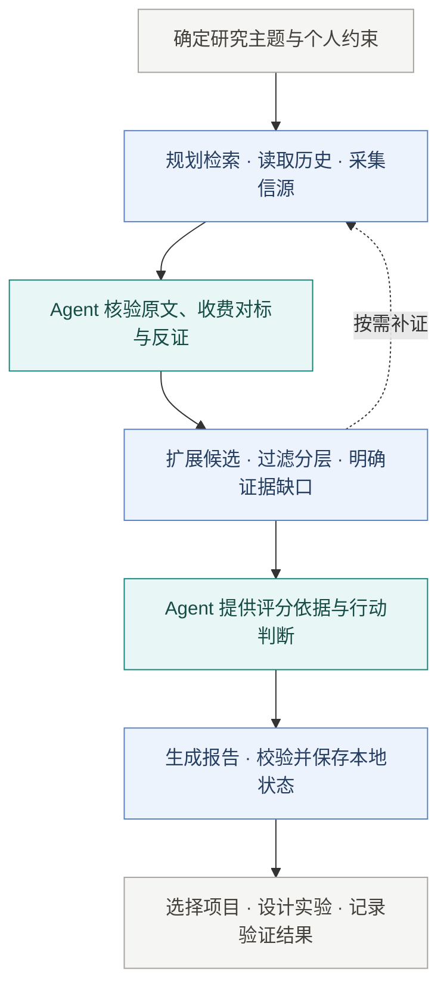

  

<h1 align="center">AI Opportunity Radar</h1>

找到值得自己做的创业项目

---

AOR 是面向 AI Agent 的创业机会研究 Skill，支持每日雷达、定向扫描、机会深挖与历史回顾。从收费产品、真实需求和地区差异出发，整理可追溯的证据，筛选候选，再结合你的能力、时间和预算，找到值得亲自验证的方向。

Agent 负责核验原文、分析机会与提出行动；Python CLI 负责采集、证据整理、候选分层、评分和报告。研究可中断恢复，历史证据可复用，报告与验证记录保存在本地。

## Skill 执行流程

研究结论是待验证的候选；客户实验的真实反馈，决定是否继续投入。

  <a href="references/quick-start.md">安装与快速开始</a> ·
  <a href="SKILL.md">Skill 入口</a> ·
  <a href="references/source-catalog.md">信源目录</a> ·
  <a href="references/engine-architecture.md">架构说明</a>

