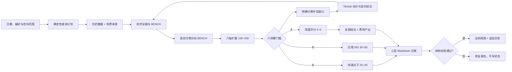

# AI Opportunity Radar

一个面向 Codex 的 AI 创业机会研究 Skill。它先寻找真实付费产品与现有支出，再围绕细分人群、购买触发、AI 新形态、地区、渠道和交付方式批量扩展点子，最后用硬门槛过滤并输出三层机会。

项目坚持“先付费事实，后需求行为，再产品形态”：批量生成可以宽，进入正式机会必须严。热门话题、愿望表达和单次搜索无结果都不会被直接包装成市场结论。

## 核心能力

| 能力 | 说明 |
|---|---|
| 付费对标 | 为每条候选建立稳定 `BENCH`，记录产品、付款者、价格/支出和付款证据 |
| 批量点子 | 沿六个维度确定性扩展 100–200 个原始候选，并保留来源对标 |
| 硬过滤 | 付款市场、付款者、替代方案、产品缺口、获客渠道、30 天 MVP 缺一不可 |
| 三层日报 | 3–5 个 A 级深度机会、20–40 个 A/B 级快速点子、30–80 个 R 级区域迁移假设 |
| 完整结论清单 | 展示全部 A/B/R、全部 overflow 和最多 20 个接近合格候选，不只返回 Top 5 |
| 定向扫描 | 按地区、语言、行业或机会类型复用同一研究流程 |
| 机会深挖 | 围绕稳定机会 ID 补充独立证据、反证、竞品、MVP 和验证实验 |
| 历史回顾 | 比较近 7/30/90 天的出现次数、评分和证据变化 |
| 多语言研究 | 覆盖英语、中文及东南亚、南亚、非洲、中东、拉美的轮换语言查询 |
| 费用产出 | 先免费发现、后付费补证，并计算证据利用率、来源转化和单个合格结论成本 |
| 可重放状态 | 使用稳定 ID、追加式观察历史、文件锁和原子写入支持安全重跑 |
| 证据升级 | R/SIG 补齐本地付款证据后，可审计地升级为 A/OPP 并保留双向链接 |

深度机会仍分三条评分轨道：

- `needle`：针尖型机会，强调明确用户、明确触发时刻和单一任务。
- `new_form`：老产品新形态，强调代理、语音、长期记忆、动态生成或社交体验带来的重做机会。
- `regional_gap`：区域错配型机会，强调语言、文化、价格、渠道和本地集成缺口。

评分只对已经通过硬门槛的 A 级候选排序。未进入 Top 5 的 A 级候选可以保留为快速卡片；B 级不做冗长推演；缺目标地区付款证据的区域创意统一保留为 R/SIG。

## 数据源范围

一期只使用已经完成端点、参数和费用约束的平台：

- 内置公开适配器：Hacker News、GitHub Issues。
- TikHub：TikTok、Instagram、LinkedIn、Threads、X、YouTube、Reddit、抖音、小红书、B站、知乎、微信搜一搜/公众号。

TikHub 采用“每日核心源 + 三日滚动源”，避免每天对全部平台重复发起相同请求。只有本次运行实际返回非空、相关且可核验证据的来源才会被标记为已覆盖。

Product Hunt、Indie Hackers、应用商店、G2/Capterra/Trustpilot、V2EX、即刻、脉脉、Telegram、微博、快手等尚未进入一期自动采集范围。

## 架构



项目分为两层：

- `SKILL.md` 与 `references/` 定义研究方法、机会政策、查询语言、安全边界和报告契约。
- `scripts/` 提供确定性工具，负责查询计划、数据采集、费用保护、规范化、稳定 ID、评分、报告校验和状态写入。

付费证据核验、反证判断、维度设计、中文翻译和报告撰写仍由 Codex 完成；扩展、硬过滤、ID、评分、报告结构与状态由脚本确定性约束。

## 环境要求

- Python 3.10 或更高版本。
- macOS 或 Linux。状态锁使用 `fcntl`，当前不支持原生 Windows。
- 运行时只依赖 Python 标准库。
- 开发与测试需要 `pytest` 和 `ruff`。
- Hacker News 无需凭证；GitHub Token 可选；TikHub 搜索需要 API Key 和显式预算。

可选环境变量：

```bash
export AI_OPPORTUNITY_RADAR_HOME="$HOME/Documents/AI-Opportunity-Radar"
export GITHUB_TOKEN="可选，用于提高 GitHub API 限额"
export TIKHUB_API_KEY="可选，仅在执行 TikHub 付费查询时需要"
```

不要把令牌写入计划、报告、状态文件或仓库。

## 安装为 Codex Skill

直接克隆到 Codex Skills 目录：

```bash
git clone https://github.com/Snychng/ai-opportunity-radar.git \
  "$HOME/.codex/skills/ai-opportunity-radar"
```

更新：

```bash
git -C "$HOME/.codex/skills/ai-opportunity-radar" pull --ff-only
```

安装后可在 Codex 中直接提出：

```text
运行今天的 AI 创业机会雷达
给我很多有真实市场需求、30 天能做 MVP 的点子
扫描东南亚本地语言 AI 社交产品机会
深挖 OPP-20260714-A1B2C3
回顾最近 30 天升温的机会
```

## 脚本快速开始

以下命令展示底层工具的主要路径。完整日报仍建议由 Codex 按 [`SKILL.md`](SKILL.md) 编排。

```bash
export SKILL_DIR="$HOME/.codex/skills/ai-opportunity-radar"
export RADAR_HOME="${AI_OPPORTUNITY_RADAR_HOME:-$HOME/Documents/AI-Opportunity-Radar}"
RUN_DATE="$(TZ=Asia/Shanghai date +%F)"
RUN_DIR="$RADAR_HOME/raw/$RUN_DATE"

mkdir -p "$RUN_DIR"

python3 "$SKILL_DIR/scripts/manage_state.py" init \
  --home "$RADAR_HOME"

python3 "$SKILL_DIR/scripts/build_query_plan.py" \
  --date "$RUN_DATE" \
  --home "$RADAR_HOME" \
  --output "$RUN_DIR/query-plan.json" \
  --export-community-plan "$RUN_DIR/community-plan.json" \
  --export-tikhub-plan "$RUN_DIR/tikhub-search-plan.json"

python3 "$SKILL_DIR/scripts/community_query.py" doctor --json

python3 "$SKILL_DIR/scripts/community_query.py" run \
  --plan "$RUN_DIR/community-plan.json" \
  --output "$RUN_DIR/community-normalized.json"
```

### TikHub：先形成候选缺口，再估价执行

先用历史、公开来源和初步过滤结果明确候选 ID、缺失门槛、目标地区、预期升级层级、本地语言关键词和 1–3 个目标来源，写入 `evidence-gaps.json`。初始化阶段导出的通用搜索计划只作草稿，不直接付费执行：

```bash
python3 "$SKILL_DIR/scripts/tikhub_query.py" build-gaps \
  --date "$RUN_DATE" \
  --run-id RUN-YYYYMMDD-XXXXXXXXXX \
  --input "$RUN_DIR/evidence-gaps.json" \
  --output "$RUN_DIR/tikhub-gap-plan.json"
```

估价只读取公开实时价格，不调用付费数据端点：

```bash
python3 "$SKILL_DIR/scripts/tikhub_query.py" estimate \
  --plan "$RUN_DIR/tikhub-gap-plan.json" \
  --output "$RUN_DIR/tikhub-cost-estimate.json"
```

确认费用后，通过环境变量提供密钥，并设置硬性预算上限：

```bash
python3 "$SKILL_DIR/scripts/tikhub_query.py" run \
  --plan "$RUN_DIR/tikhub-gap-plan.json" \
  --max-cost-usd 0.10 \
  --output "$RUN_DIR/tikhub-gap-results.json"

python3 "$SKILL_DIR/scripts/normalize_tikhub_results.py" \
  --input "$RUN_DIR/tikhub-gap-results.json" \
  --output "$RUN_DIR/tikhub-normalized-search.json" \
  --selection-output "$RUN_DIR/tikhub-comment-candidates.json"
```

执行器会依次检查：实时价格、端点白名单、最坏成本、零费用账户预检端点、账户状态、免费额度和付费余额。任一条件不满足时，不发起付费数据请求。

付费发现最多占预算 20%；每个请求必须服务于候选升级或硬门槛验证。连续 3 个请求没有新增 BENCH、A/B/R 或关键证据时停止该来源。

从评论候选中选择 1–5 条并补充 `selection_reason` 后，可按 [`references/tikhub-integration.md`](references/tikhub-integration.md) 生成独立评论计划。评论翻页必须重新建计划和估价。

### 付费对标、批量扩展与硬过滤

先按 [`references/data-contracts.md`](references/data-contracts.md) 整理 `benchmarks-and-dimensions.json`。仓库提供了可直接运行的[示例输入](examples/benchmarks-and-dimensions.json)；其中 URL 和商业数据均为演示占位符，不是市场证据：

```bash
python3 "$SKILL_DIR/scripts/expand_ideas.py" \
  --input "$RUN_DIR/benchmarks-and-dimensions.json" \
  --limit 200 \
  --output "$RUN_DIR/expanded-candidates.json"

python3 "$SKILL_DIR/scripts/filter_ideas.py" \
  --input "$RUN_DIR/expanded-candidates.json" \
  --output "$RUN_DIR/tiered-candidates.json"
```

过滤结果包含 `deep_candidates`、`validated_ideas`、`regional_signals` 和带失败原因的 `rejected`。目标数量不足时保留真实数量，不用弱证据补齐。

### 完整结论清单与费用产出

日报前生成完整清单。`--execution`、`--evidence`、`--research` 均可重复传入实际存在的文件：

```bash
python3 "$SKILL_DIR/scripts/build_result_digest.py" \
  --tiered "$RUN_DIR/tiered-candidates.json" \
  --execution "$RUN_DIR/tikhub-gap-results.json" \
  --evidence "$RUN_DIR/tikhub-normalized-search.json" \
  --output "$RADAR_HOME/reports/daily/$RUN_DATE-full-results.md" \
  --metrics-output "$RUN_DIR/result-yield.json"
```

输出会展示全部 A/B/R 和 overflow、接近合格拒绝项、付费请求、费用、证据利用率、单个合格结论成本与来源转化。聊天默认展示这份清单的全部紧凑卡片，不能只给 Top 5 或链接。

### 稳定 ID、A 级评分与状态提交

候选评分前必须先分配稳定 ID：

```bash
python3 "$SKILL_DIR/scripts/manage_state.py" prepare \
  --home "$RADAR_HOME" \
  --kind opportunity \
  --date "$RUN_DATE" \
  --input "$RUN_DIR/deep-candidates.json" \
  --output "$RUN_DIR/deep-candidates-with-ids.json"

python3 "$SKILL_DIR/scripts/score_candidates.py" \
  --input "$RUN_DIR/deep-candidates-with-ids.json" \
  --output "$RUN_DIR/scored-deep-candidates.json"
```

Markdown 日报结构校验通过后才能写入历史：

```bash
python3 "$SKILL_DIR/scripts/validate_report.py" \
  "$RADAR_HOME/reports/daily/$RUN_DATE.md"

python3 "$SKILL_DIR/scripts/manage_state.py" record-batch \
  --home "$RADAR_HOME" \
  --kind opportunity \
  --date "$RUN_DATE" \
  --run-id RUN-YYYYMMDD-XXXXXXXXXX \
  --input "$RUN_DIR/opportunities.json"
```

R 级区域创意应使用 `--kind signal` 独立分配和提交。实际 `run_id` 从 `query-plan.json` 读取，不手工构造或跨日期复用。

R/SIG 补齐目标地区直接付款证据后可升级：

```bash
python3 "$SKILL_DIR/scripts/manage_state.py" promote \
  --home "$RADAR_HOME" \
  --signal-id SIG-YYYYMMDD-XXXXXX \
  --date "$RUN_DATE" \
  --run-id RUN-YYYYMMDD-XXXXXXXXXX \
  --input "$RUN_DIR/promoted-opportunity.json"
```

## 数据契约

- `schema_version`：当前为 `3.0`。
- 运行 ID：`RUN-YYYYMMDD-XXXXXXXXXX`。
- 付费对标 ID：`BENCH-XXXXXXXX`。
- 机会 ID：`OPP-YYYYMMDD-XXXXXX`。
- 信号 ID：`SIG-YYYYMMDD-XXXXXX`。
- 机会身份由 `target_user + context + problem_or_desire + wedge`，以及存在时的国家、地区和主渠道决定；不依赖标题或翻译。
- 同一 `run_id + kind + fingerprint` 重放不会重复创建观察事件。
- 同日不同运行可以保存新的评分快照，但 `occurrences` 只按唯一日期计数。

详细阶段输入输出见 [`references/data-contracts.md`](references/data-contracts.md)。

## 状态目录

```text
$RADAR_HOME/
├── config/
│   └── preferences.json
├── raw/
│   └── YYYY-MM-DD/
├── reports/
│   ├── daily/
│   └── deep-dives/
└── state/
    ├── opportunities.jsonl
    ├── opportunity-observations.jsonl
    ├── signals.jsonl
    ├── signal-observations.jsonl
    ├── source-health.json
    └── source-health-events.jsonl
```

`opportunities.jsonl` 和 `signals.jsonl` 是当前视图；`*-observations.jsonl` 是追加式历史。所有状态更新都经过文件锁和原子替换。

## 评分模型

三条轨道使用不同权重，满分均为 100：

| 维度 | 针尖型 | 新形态 | 区域错配 |
|---|---:|---:|---:|
| 需求强度 | 2.5 | 2.0 | 2.0 |
| 产品新形态 | 0.5 | 2.5 | 0.5 |
| 分发能力 | 1.5 | 1.5 | 1.5 |
| 区域缺口 | 0.5 | 0.5 | 2.5 |
| 商业化 | 1.5 | 1.0 | 1.5 |
| MVP 可行性 | 2.0 | 1.5 | 1.0 |
| 证据质量 | 1.5 | 1.0 | 1.0 |

单一独立来源的 `confidence` 自动限制为不高于 4。评分只排序已通过六项门槛的 A 级候选；B/R 的分层由证据契约决定。

## 安全边界

- 不绕过验证码、访问控制、付费墙或平台保护措施。
- TikHub 仅允许固定官方域名、白名单端点和受测参数。
- API Key 只能通过环境变量传入；响应中的常见凭证字段会被清洗。
- 不把搜索摘要当作用户原话，不批量转载帖子或评论。
- 不把第三方 API 或浏览器偶尔可访问的数据描述成可长期商业化的数据源。
- 排除医疗诊断治疗、金融投资建议、法律意见、儿童敏感产品及违法内容。

完整规则见 [`references/safety-and-legality.md`](references/safety-and-legality.md)。

## 项目结构

```text
.
├── SKILL.md                       # Skill 入口与完整执行流程
├── examples/                      # 付费对标与六轴扩展示例
├── references/                    # 研究、评分、安全、数据和报告契约
├── scripts/
│   ├── build_query_plan.py        # 确定性查询计划与平台轮换
│   ├── build_result_digest.py     # 全部结论与费用产出清单
│   ├── community_query.py         # HN / GitHub 公开适配器
│   ├── contracts.py               # schema、run_id、稳定 ID
│   ├── expand_ideas.py            # 从 BENCH 做六轴确定性扩展
│   ├── filter_ideas.py            # 六项硬门槛与 A/B/R 分层
│   ├── manage_state.py            # 当前视图、追加历史、幂等写入与 SIG 升级
│   ├── normalize_tikhub_results.py # TikHub 搜索与评论规范化
│   ├── score_candidates.py        # 三轨评分
│   ├── tikhub_query.py            # TikHub 白名单、估价与执行
│   └── validate_report.py         # Markdown 日报结构校验
└── tests/                          # 单元、集成和 CLI 路径测试
```

## 开发与测试

```bash
python3 -m py_compile scripts/*.py
ruff check scripts tests
pytest -q
```

当前测试覆盖查询计划、多语言轮换、TikHub 费用与账户预检、付费对标扩展、六项硬门槛、A/B/R 分层、完整结论与费用产出、跨地区稳定身份、SIG→OPP 升级、评分、三层报告校验、追加式状态和 CLI 主流程。

## 参考文档

- [`SKILL.md`](SKILL.md)：完整 Skill 工作流。
- [`references/research-workflow.md`](references/research-workflow.md)：研究与反证流程。
- [`references/source-catalog.md`](references/source-catalog.md)：来源边界与覆盖口径。
- [`references/query-patterns.md`](references/query-patterns.md)：多语言查询模式。
- [`references/scoring.md`](references/scoring.md)：评分契约。
- [`references/data-contracts.md`](references/data-contracts.md)：阶段与幂等契约。
- [`references/report-template.md`](references/report-template.md)：日报输出格式。
- [`references/tikhub-integration.md`](references/tikhub-integration.md)：TikHub 费用与评论链路。
- [`references/safety-and-legality.md`](references/safety-and-legality.md)：安全和合规边界。

## 已知边界

- 报告校验器只验证结构、字段和部分一致性，不证明市场规模、引用真实性或法律结论。
- 社交平台数据受第三方服务、地区、限流和平台策略影响，不能承诺完整覆盖。
- 聚类、反证和产品判断仍需要 Codex 或人工复核。
- TikHub 估算不是账单；实际扣费以 TikHub 使用日志为准。
- 当前没有原生 Windows 状态锁实现。
