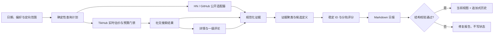

# AI Opportunity Radar

一个面向 Codex 的 AI 创业机会研究 Skill。它从公开社区、开发者反馈和受预算保护的社交平台数据中提取真实问题、欲望、替代行为与付费信号，生成每日机会雷达、定向扫描、单机会深挖和历史趋势回顾。

项目坚持“先证据，后机会，再产品形态”：不会把热门话题直接包装成创业方向，也不会把单次搜索无结果解释为没有需求或没有竞品。

## 核心能力

| 能力 | 说明 |
|---|---|
| 每日雷达 | 输出 3–5 个深度机会、最多 20 个早期信号、覆盖缺口与历史变化 |
| 定向扫描 | 按地区、语言、行业或机会类型复用同一研究流程 |
| 机会深挖 | 围绕稳定机会 ID 补充独立证据、反证、竞品、MVP 和验证实验 |
| 历史回顾 | 比较近 7/30/90 天的出现次数、评分和证据变化 |
| 多语言研究 | 覆盖英语、中文及东南亚、南亚、非洲、中东、拉美的轮换语言查询 |
| 费用保护 | TikHub 请求执行前强制刷新价格、估算最坏成本、检查账户与显式预算 |
| 可重放状态 | 使用稳定 ID、追加式观察历史、文件锁和原子写入支持安全重跑 |

机会分为三条轨道：

- `needle`：针尖型机会，强调明确用户、明确触发时刻和单一任务。
- `new_form`：老产品新形态，强调代理、语音、长期记忆、动态生成或社交体验带来的重做机会。
- `regional_gap`：区域错配型机会，强调语言、文化、价格、渠道和本地集成缺口。

## 数据源范围

一期只使用已经完成端点、参数和费用约束的平台：

- 内置公开适配器：Hacker News、GitHub Issues。
- TikHub：TikTok、Instagram、LinkedIn、Threads、X、YouTube、Reddit、抖音、小红书、B站、知乎、微信搜一搜/公众号。

TikHub 采用“每日核心源 + 三日滚动源”，避免每天对全部平台重复发起相同请求。只有本次运行实际返回非空、相关且可核验证据的来源才会被标记为已覆盖。

Product Hunt、Indie Hackers、应用商店、G2/Capterra/Trustpilot、V2EX、即刻、脉脉、Telegram、微博、快手等尚未进入一期自动采集范围。

## 架构



项目分为两层：

- `SKILL.md` 与 `references/` 定义研究方法、机会政策、查询语言、安全边界和报告契约。
- `scripts/` 提供确定性工具，负责查询计划、数据采集、费用保护、规范化、稳定 ID、评分、报告校验和状态写入。

证据聚类、反证判断、候选定义、中文翻译和报告撰写仍由 Codex 完成；项目不是一个无需判断的一键市场研究脚本。

## 环境要求

- Python 3.10 或更高版本。
- macOS 或 Linux。状态锁使用 `fcntl`，当前不支持原生 Windows。
- 运行时只依赖 Python 标准库。
- 开发与测试需要 `pytest` 和 `ruff`。
- Hacker News 无需凭证；GitHub Token 可选；TikHub 搜索需要 API Key 和显式预算。

可选环境变量：

```bash
export AI_OPPORTUNITY_RADAR_HOME="$HOME/Documents/AI-Opportunity-Radar"
export GITHUB_TOKEN="可选，用于提高 GitHub API 限额"
export TIKHUB_API_KEY="可选，仅在执行 TikHub 付费查询时需要"
```

不要把令牌写入计划、报告、状态文件或仓库。

## 安装为 Codex Skill

直接克隆到 Codex Skills 目录：

```bash
git clone https://github.com/Snychng/ai-opportunity-radar.git \
  "$HOME/.codex/skills/ai-opportunity-radar"
```

更新：

```bash
git -C "$HOME/.codex/skills/ai-opportunity-radar" pull --ff-only
```

安装后可在 Codex 中直接提出：

```text
运行今天的 AI 创业机会雷达
扫描东南亚本地语言 AI 社交产品机会
深挖 OPP-20260714-A1B2C3
回顾最近 30 天升温的机会
```

## 脚本快速开始

以下命令展示底层工具的主要路径。完整日报仍建议由 Codex 按 [`SKILL.md`](SKILL.md) 编排。

```bash
export SKILL_DIR="$HOME/.codex/skills/ai-opportunity-radar"
export RADAR_HOME="${AI_OPPORTUNITY_RADAR_HOME:-$HOME/Documents/AI-Opportunity-Radar}"
RUN_DATE="$(TZ=Asia/Shanghai date +%F)"
RUN_DIR="$RADAR_HOME/raw/$RUN_DATE"

mkdir -p "$RUN_DIR"

python3 "$SKILL_DIR/scripts/manage_state.py" init \
  --home "$RADAR_HOME"

python3 "$SKILL_DIR/scripts/build_query_plan.py" \
  --date "$RUN_DATE" \
  --home "$RADAR_HOME" \
  --output "$RUN_DIR/query-plan.json" \
  --export-community-plan "$RUN_DIR/community-plan.json" \
  --export-tikhub-plan "$RUN_DIR/tikhub-search-plan.json"

python3 "$SKILL_DIR/scripts/community_query.py" doctor --json

python3 "$SKILL_DIR/scripts/community_query.py" run \
  --plan "$RUN_DIR/community-plan.json" \
  --output "$RUN_DIR/community-normalized.json"
```

### TikHub：先估价，再执行

估价只读取公开实时价格，不调用付费数据端点：

```bash
python3 "$SKILL_DIR/scripts/tikhub_query.py" estimate \
  --plan "$RUN_DIR/tikhub-search-plan.json" \
  --output "$RUN_DIR/tikhub-cost-estimate.json"
```

确认费用后，通过环境变量提供密钥，并设置硬性预算上限：

```bash
python3 "$SKILL_DIR/scripts/tikhub_query.py" run \
  --plan "$RUN_DIR/tikhub-search-plan.json" \
  --max-cost-usd 0.10 \
  --output "$RUN_DIR/tikhub-search-results.json"

python3 "$SKILL_DIR/scripts/normalize_tikhub_results.py" \
  --input "$RUN_DIR/tikhub-search-results.json" \
  --output "$RUN_DIR/tikhub-normalized-search.json" \
  --selection-output "$RUN_DIR/tikhub-comment-candidates.json"
```

执行器会依次检查：实时价格、端点白名单、最坏成本、零费用账户预检端点、账户状态、免费额度和付费余额。任一条件不满足时，不发起付费数据请求。

从评论候选中选择 1–5 条并补充 `selection_reason` 后，可按 [`references/tikhub-integration.md`](references/tikhub-integration.md) 生成独立评论计划。评论翻页必须重新建计划和估价。

### 稳定 ID、评分与状态提交

候选评分前必须先分配稳定 ID：

```bash
python3 "$SKILL_DIR/scripts/manage_state.py" prepare \
  --home "$RADAR_HOME" \
  --kind opportunity \
  --date "$RUN_DATE" \
  --input "$RUN_DIR/candidates.json" \
  --output "$RUN_DIR/candidates-with-ids.json"

python3 "$SKILL_DIR/scripts/score_candidates.py" \
  --input "$RUN_DIR/candidates-with-ids.json" \
  --output "$RUN_DIR/scored-candidates.json"
```

Markdown 日报结构校验通过后才能写入历史：

```bash
python3 "$SKILL_DIR/scripts/validate_report.py" \
  "$RADAR_HOME/reports/daily/$RUN_DATE.md"

python3 "$SKILL_DIR/scripts/manage_state.py" record-batch \
  --home "$RADAR_HOME" \
  --kind opportunity \
  --date "$RUN_DATE" \
  --run-id RUN-YYYYMMDD-XXXXXXXXXX \
  --input "$RUN_DIR/scored-candidates.json"
```

实际 `run_id` 从 `query-plan.json` 读取。不要手工构造或跨日期复用。

## 数据契约

- `schema_version`：当前为 `2.0`。
- 运行 ID：`RUN-YYYYMMDD-XXXXXXXXXX`。
- 机会 ID：`OPP-YYYYMMDD-XXXXXX`。
- 信号 ID：`SIG-YYYYMMDD-XXXXXX`。
- 机会身份由 `target_user + context + problem_or_desire + wedge` 决定，不依赖标题或翻译。
- 同一 `run_id + kind + fingerprint` 重放不会重复创建观察事件。
- 同日不同运行可以保存新的评分快照，但 `occurrences` 只按唯一日期计数。

详细阶段输入输出见 [`references/data-contracts.md`](references/data-contracts.md)。

## 状态目录

```text
$RADAR_HOME/
├── config/
│   └── preferences.json
├── raw/
│   └── YYYY-MM-DD/
├── reports/
│   ├── daily/
│   └── deep-dives/
└── state/
    ├── opportunities.jsonl
    ├── opportunity-observations.jsonl
    ├── signals.jsonl
    ├── signal-observations.jsonl
    ├── source-health.json
    └── source-health-events.jsonl
```

`opportunities.jsonl` 和 `signals.jsonl` 是当前视图；`*-observations.jsonl` 是追加式历史。所有状态更新都经过文件锁和原子替换。

## 评分模型

三条轨道使用不同权重，满分均为 100：

| 维度 | 针尖型 | 新形态 | 区域错配 |
|---|---:|---:|---:|
| 需求强度 | 2.5 | 2.0 | 2.0 |
| 产品新形态 | 0.5 | 2.5 | 0.5 |
| 分发能力 | 1.5 | 1.5 | 1.5 |
| 区域缺口 | 0.5 | 0.5 | 2.5 |
| 商业化 | 1.5 | 1.0 | 1.5 |
| MVP 可行性 | 2.0 | 1.5 | 1.0 |
| 证据质量 | 1.5 | 1.0 | 1.0 |

单一独立来源的 `confidence` 自动限制为不高于 4。评分用于排序与分层，不是删除早期机会的硬阈值。

## 安全边界

- 不绕过验证码、访问控制、付费墙或平台保护措施。
- TikHub 仅允许固定官方域名、白名单端点和受测参数。
- API Key 只能通过环境变量传入；响应中的常见凭证字段会被清洗。
- 不把搜索摘要当作用户原话，不批量转载帖子或评论。
- 不把第三方 API 或浏览器偶尔可访问的数据描述成可长期商业化的数据源。
- 排除医疗诊断治疗、金融投资建议、法律意见、儿童敏感产品及违法内容。

完整规则见 [`references/safety-and-legality.md`](references/safety-and-legality.md)。

## 项目结构

```text
.
├── SKILL.md                       # Skill 入口与完整执行流程
├── references/                    # 研究、评分、安全、数据和报告契约
├── scripts/
│   ├── build_query_plan.py        # 确定性查询计划与平台轮换
│   ├── community_query.py         # HN / GitHub 公开适配器
│   ├── contracts.py               # schema、run_id、稳定 ID
│   ├── manage_state.py            # 当前视图、追加历史与幂等写入
│   ├── normalize_tikhub_results.py # TikHub 搜索与评论规范化
│   ├── score_candidates.py        # 三轨评分
│   ├── tikhub_query.py            # TikHub 白名单、估价与执行
│   └── validate_report.py         # Markdown 日报结构校验
└── tests/                          # 单元、集成和 CLI 路径测试
```

## 开发与测试

```bash
python3 -m py_compile scripts/*.py
ruff check scripts tests
pytest -q
```

当前测试覆盖查询计划、30 日窗口、多语言轮换、TikHub 费用与账户预检、业务错误、搜索到评论的标识转换、证据规范化、评分、报告校验、追加式状态和 CLI 主流程。

## 参考文档

- [`SKILL.md`](SKILL.md)：完整 Skill 工作流。
- [`references/research-workflow.md`](references/research-workflow.md)：研究与反证流程。
- [`references/source-catalog.md`](references/source-catalog.md)：来源边界与覆盖口径。
- [`references/query-patterns.md`](references/query-patterns.md)：多语言查询模式。
- [`references/scoring.md`](references/scoring.md)：评分契约。
- [`references/data-contracts.md`](references/data-contracts.md)：阶段与幂等契约。
- [`references/report-template.md`](references/report-template.md)：日报输出格式。
- [`references/tikhub-integration.md`](references/tikhub-integration.md)：TikHub 费用与评论链路。
- [`references/safety-and-legality.md`](references/safety-and-legality.md)：安全和合规边界。

## 已知边界

- 报告校验器只验证结构、字段和部分一致性，不证明市场规模、引用真实性或法律结论。
- 社交平台数据受第三方服务、地区、限流和平台策略影响，不能承诺完整覆盖。
- 聚类、反证和产品判断仍需要 Codex 或人工复核。
- TikHub 估算不是账单；实际扣费以 TikHub 使用日志为准。
- 当前没有原生 Windows 状态锁实现。
