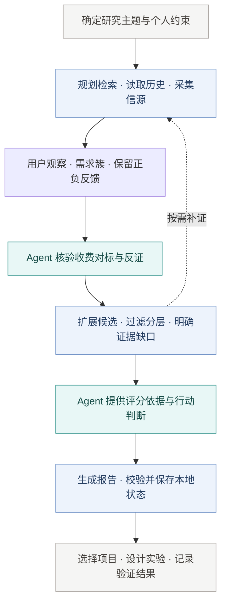

  

<h1 align="center">AI Opportunity Radar</h1>

找到值得自己做的创业项目

---

AOR 是面向 AI Agent 的创业机会研究 Skill，支持每日雷达、定向扫描、机会深挖与历史回顾。从收费产品、真实需求和地区差异出发，整理可追溯的证据，筛选候选，再结合你的能力、时间和预算，找到值得亲自验证的方向。

v4.3 增加[评论优先的产品研究](references/comment-first-discovery.md)：从小红书、抖音、X 的实际评论提取用户观察和需求簇，再研究商业方案。早期需求不必先满足收费对标和 AI 方案要求；正式候选仍需完整证据。三平台分页采集需要明确的一次性预算，免费社区评论默认开启。

Agent 负责核验原文、分析机会与提出行动；Python CLI 负责采集、证据整理、候选分层、评分和报告。研究可中断恢复，历史证据可复用，报告与验证记录保存在本地。

默认覆盖电商、游戏、创作、成人学习、生活及传统互联网产品的 AI 改造与迁移。每个方向独立规划中英文任务查询，报告展示真实覆盖与缺口；普通用户的持续使用、创作、学习等行为也能成为需求证据。证据不足的早期想法保留为待验证线索，并要求说明 AI 相对现有办法的具体增量。[范围配置、预算发现与线索流程](references/cross-industry-discovery.md)。

六个方向现包含 36 个子赛道，按历史调查缺口轮转中英文任务。帖子、评论及原文修订独立保存；采集成功、词面相关、人工核验和商业证据分别统计。流程 `completed` 表示研究档案已保存，未补齐的市场证据仍会进入后续调查队列。

网站读取独立的 `public.v1.json`，不直接公开内部 `report.json`。公开数据按白名单导出，提供 JSON Schema、TypeScript 类型、全量／列表／详情视图；未完成发布复核或引用失效的内容不会作为已发布条目输出。[网站接入与版本兼容](references/website-contract.md)。

材料较多时，可用[批量审阅队列](references/review-queue.md)按行业并行处理，并用[真实检索基准](references/retrieval-benchmark.md)统计用户任务、供应商推广和旧材料。网站可参照[消费端示例](examples/website-consumer/README.md)接入，展示来源复核日期、待补证与归档状态。跨运行费用使用[共享预算](references/tikhub-integration.md)记录；持续采集默认关闭。

## Skill 执行流程

研究结论是待验证的候选；客户实验的真实反馈，决定是否继续投入。

  <a href="references/quick-start.md">安装与快速开始</a> ·
  <a href="SKILL.md">Skill 入口</a> ·
  <a href="references/source-catalog.md">信源目录</a> ·
  <a href="references/engine-architecture.md">架构说明</a>

